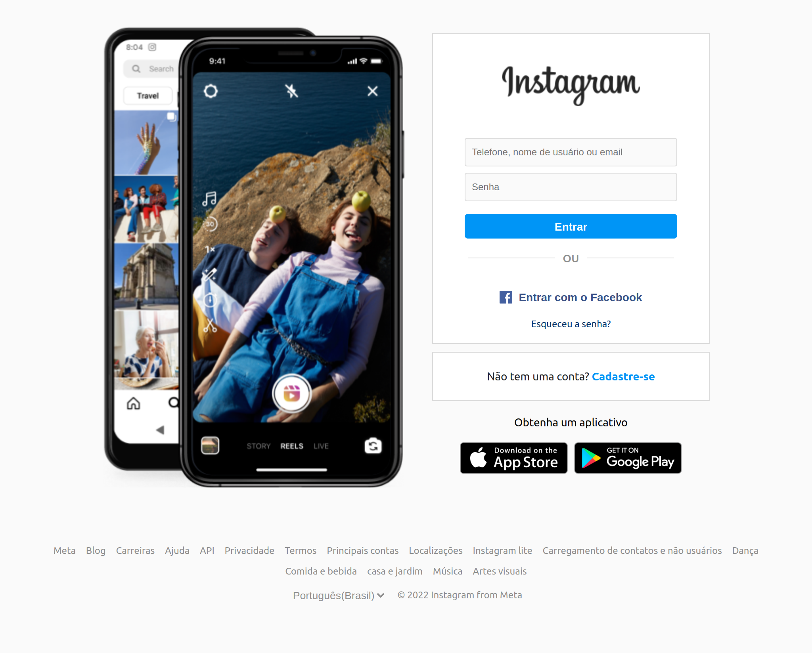
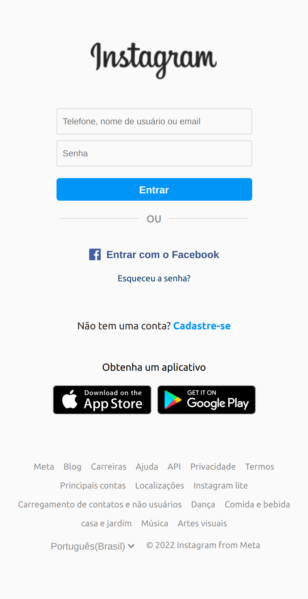

  
<h1>Recriando a página inicial do Instagram
</h2>
  

 <a href="#objetivo">Objetivo</a> •
 <a href="#preview">Preview</a> •
 <a href="#tecnologias">Tecnologias utilizadas</a> • 

<h3 id="objetivo">:dart:  Objetivo</h3>

🚀 O projeto desenvolvido é um desafio para o Bootcamp Impulso Javascript Evolution da 
<a href="https://www.dio.me/">Digital Innovation One </a>, cujo objetivo é reconstruir a página de login do Instagram. Para isso, é recomendado o uso de CSS com Flexbox, uma das abordagens de posicionamento de elementos mais utilizadas quando se trata de responsividade.

  <h3 id="preview">:camera_flash: Desktop - Página inicial do Instagram</h3>
  
  <h3 id="preview">:iphone: Mobile - Página inicial do Instagram</h3>
  
    

<h3 id="tecnologias">🛠 Tecnologias utilizadas</h3>

- HTML5
- CSS3
- Clean CSS CLI

## 🦄 Autor 

<table>
  <tr>
    <td align="center">
      <a href="https://github.com/Flaviane-Brum">
         
        
          <b>Flaviane Brum</b>
        
      </a>
    </td>
  </tr>
</table>
